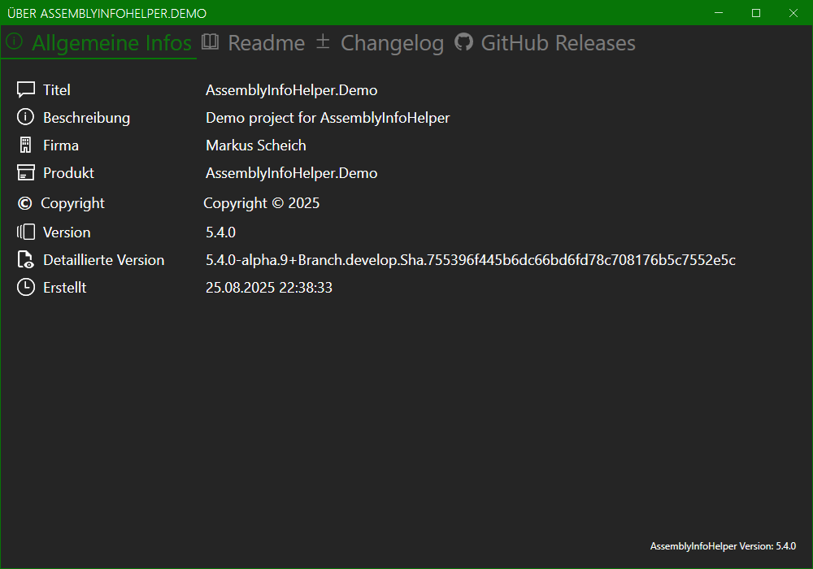
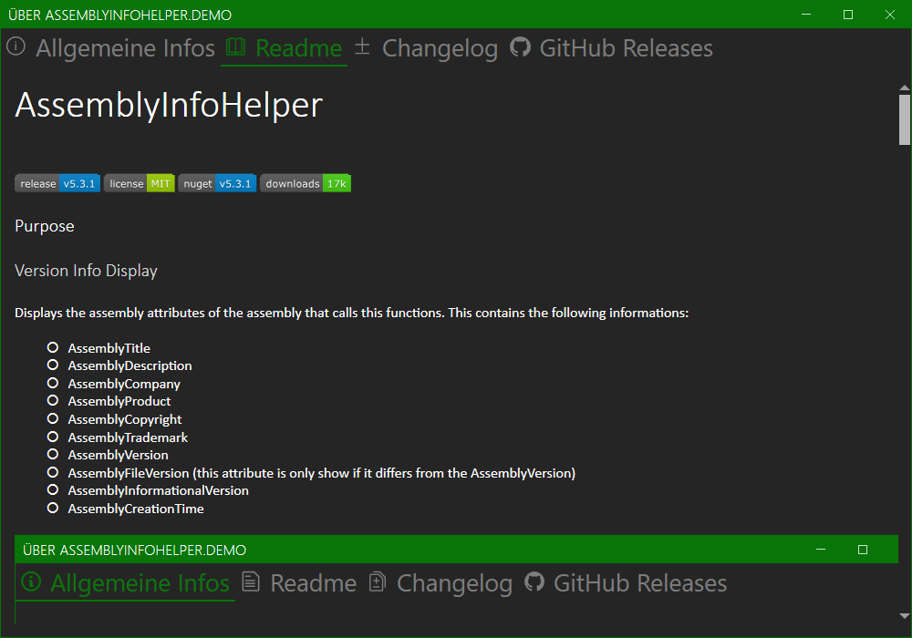
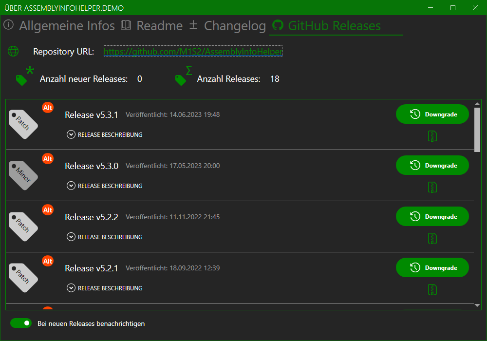

# AssemblyInfoHelper

[](https://www.nuget.org/packages/AssemblyInfoHelper/)

[](LICENSE.md)


## Purpose

The **AssemblyInfoHelper** gets and displays the assembly attributes of the assembly that calls this functions.
This contains the following informations:
- AssemblyTitle
- AssemblyDescription
- AssemblyCompany
- AssemblyProduct
- AssemblyCopyright
- AssemblyTrademark
- AssemblyVersion
- AssemblyFileVersion (this attribute is only show if it differs from the AssemblyVersion)
- AssemblyInformationalVersion
- AssemblyCreationTime



The readme is get from the README.md file in the path given when creating the WindowAssemblyInfo or the application startup path.



The changelog is get from the CHANGELOG.md file in the path given when creating the WindowAssemblyInfo or the application startup path.


GitHub releases are taken from repository at the url given by the `GitHubRepo` attribute (see usage below). 



The **AssemblyInfoHelper.Demo** is used to test the AssemblyInfoHelper.

## Installation

Include the [latest release from nuget.org](https://www.nuget.org/packages/AssemblyInfoHelper/) in your project.

You can also use the Package Manager console with: `PM> Install-Package AssemblyInfoHelper`

## Usage

To show all releases from GitHub add the `GitHubRepo` attribute to the AssemblyInfo.cs file: 

```csharp
[assembly: AssemblyInfoHelper.GitHub.GitHubRepo("https://github.com/M1S2/AssemblyInfoHelper")]
```


The simplest way to show the WindowAssemblyInfo is to add a `AppInfoButton` control to the application. Everything is done inside this control.

```csharp
xmlns:assemblyInfoHelper="clr-namespace:AssemblyInfoHelper;assembly=AssemblyInfoHelper"
...
<assemblyInfoHelper:AppInfoButton EnableNewVersionNotification="True"/>
```


Or you can open the info window with: 

```csharp
AssemblyInfoHelper.WindowAssemblyInfo window = new AssemblyInfoHelper.WindowAssemblyInfo();
window.ShowDialog();
```

## Add assembly attributes

### New style projects
Add the following properties to a .csproj file to include assembly attributes:
```csharp
<PropertyGroup>
	<GenerateAssemblyInfo>true</GenerateAssemblyInfo>
	<Title>TitleText</Title>
	<Description>DescriptionText</Description>
	<Company>CompanyText</Company>
	<Product>ProductText</Product>
	<Copyright>Copyright © 2022</Copyright>
</PropertyGroup>
```

### Old style projects
Add the following lines to the AssemblyInfo.cs file to include assembly attributes:
```csharp
[assembly: AssemblyTitle("TitleText")]
[assembly: AssemblyDescription("DescriptionText")]
[assembly: AssemblyCompany("CompanyText")]
[assembly: AssemblyProduct("ProductText")]
[assembly: AssemblyCopyright("Copyright © 2022")]
[assembly: AssemblyTrademark("TrademarkText")]
```

## Update Feature

You can see and download all releases available on GitHub on the GitHub releases tab.
To Upgrade/Repair/Downgrade click on the button beside the corresponding release. The release is downloaded from GitHub and installed automatically depending if an installer or binaries are available.